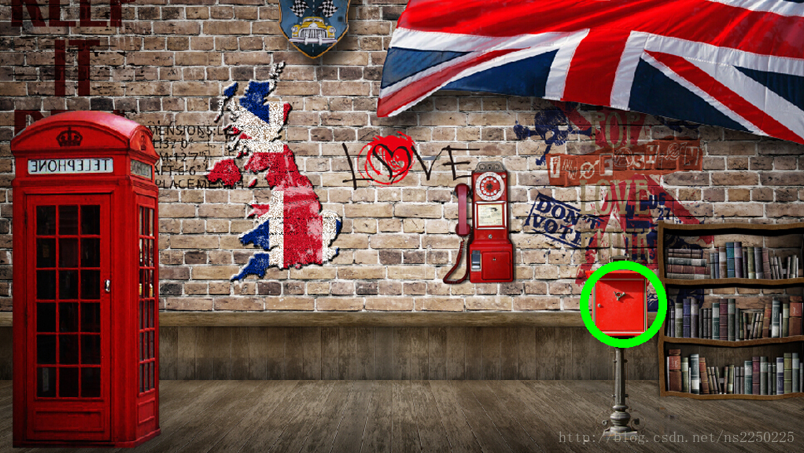

# Airtest基于图像识别的UI自动化测试工具

## 原理

1. 截取一张目标UI的图片，比如一个按钮的图片
2. 通过opencv库的模板匹配，得出所截图片在原图中的位置坐标
3. 通过adb工具连接手机，发送操作命令，比如点击所截图片的位置

## 官网地址

* [http://airtest.netease.com/](http://airtest.netease.com/)

## 参考的开源项目

* **SikuliX**

## 模仿的DEMO

### 通过截图匹配原图中的位置

```python
# python2.7
# 下载安装opencv-2.4.9，并将cv2.pyd拷贝到python安装目录的site-package下
# pip install numpy
# pip install aircv

import cv2
import aircv as ac

# 画出匹配位置的圆圈
def draw_circle(img, pos, circle_radius, color, line_width):
    cv2.circle(img, pos, circle_radius, color, line_width)
    cv2.imshow('objDetect', imsrc) 
    cv2.waitKey(0)
    cv2.destroyAllWindows()

if __name__ == "__main__":
    imsrc = ac.imread('bg.jpg')
    imobj = ac.imread('obj.png')

    # 运用模板匹配，查找匹配到原图中的位置坐标
    pos = ac.find_template(imsrc, imobj)

    circle_center_pos = pos['result']
    circle_radius = 50
    color = (0, 255, 0)
    line_width = 10

    # 画出坐标为中心的圆圈
    draw_circle(imsrc, circle_center_pos, circle_radius, color, line_width)
```


### 效果展示




