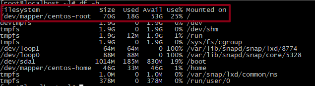

# CentOS7不重启扩展根分区磁盘空间

## 机器环境

* CentOS7
* 一块新的硬盘（这里是20G的硬盘）

## 扫描新的磁盘设备

```text
# ls /sys/class/scsi_host/
# echo "- - -" > /sys/class/scsi_host/host0/scan
# echo "- - -" > /sys/class/scsi_host/host1/scan
# echo "- - -" > /sys/class/scsi_host/host2/scan

# ls /sys/class/scsi_device/
# echo 1 > /sys/class/scsi_device/0\:0\:0\:0/device/rescan
# echo 1 > /sys/class/scsi_device/2\:0\:0\:0/device/rescan

fdisk -l
```


## 新建物理卷并添加到卷组

```text
# pvcreate /dev/sdb
# vgextend centos /dev/sdb
# vgdisplay
```

##  扩展逻辑卷，然后添加到根分区

```text
# lvextend -L +20G /dev/mapper/centos-root
# xfs_growfs /dev/mapper/centos-root
# df -h
```




