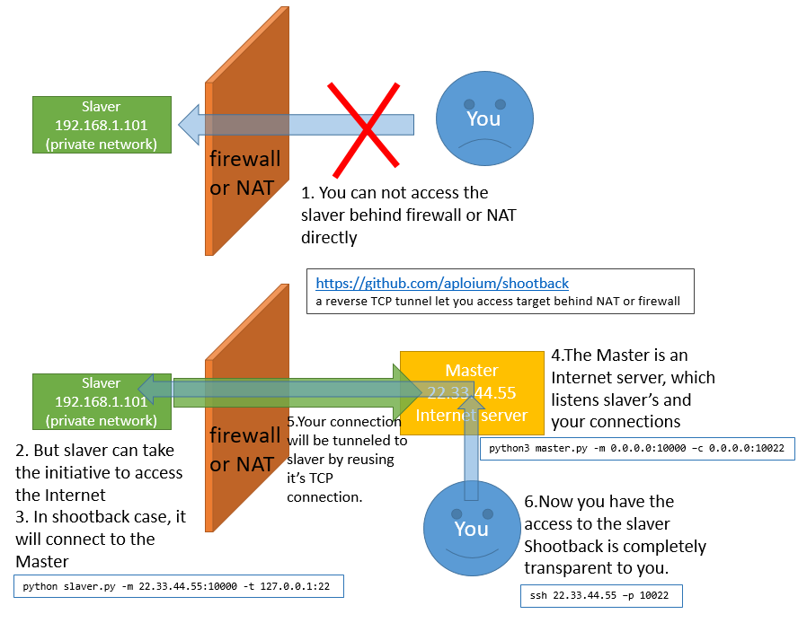

# 内网穿透--TCP打洞

## 原理

* 准备一台内网机器（Slaver），一台外网机器（Master）
* Master一边监听Slaver的连接，一边监听来自外网客户端的连接
* Master将外网客户端的连接进行解析并转发给Slaver，实现外网访问内网（内网穿透）



## 代码实现

### Master.py

```python
#!/usr/bin/env python3
# coding=utf-8
from common_func import *
import queue
import atexit

_listening_sockets = []  # for close at exit
__author__ = "Aploium <i@z.codes>"
__website__ = "https://github.com/aploium/shootback"


@atexit.register
def close_listening_socket_at_exit():
    log.info("exiting...")
    for s in _listening_sockets:
        log.info("closing: {}".format(s))
        try_close(s)


def try_bind_port(sock, addr):
    while True:
        try:
            sock.bind(addr)
        except Exception as e:
            log.error(("unable to bind {}, {}. If this port was used by the recently-closed shootback itself\n"
                       "then don't worry, it would be available in several seconds\n"
                       "we'll keep trying....").format(addr, e))
            log.debug(traceback.format_exc())
            time.sleep(3)
        else:
            break


class Master:
    def __init__(self, customer_listen_addr, communicate_addr=None,
                 slaver_pool=None, working_pool=None):
        """
        :param customer_listen_addr: equals to the -c/--customer param
        :param communicate_addr: equals to the -m/--master param
        """
        self.thread_pool = {}
        self.thread_pool["spare_slaver"] = {}
        self.thread_pool["working_slaver"] = {}

        self.working_pool = working_pool or {}

        self.socket_bridge = SocketBridge()

        # a queue for customers who have connected to us,
        #   but not assigned a slaver yet
        self.pending_customers = queue.Queue()

        self.communicate_addr = communicate_addr

        _fmt_communicate_addr = fmt_addr(self.communicate_addr)

        if slaver_pool:
            # 若使用外部slaver_pool, 就不再初始化listen
            # 这是以后待添加的功能
            self.external_slaver = True
            self.thread_pool["listen_slaver"] = None
        else:
            # 自己listen来获取slaver
            self.external_slaver = False
            self.slaver_pool = collections.deque()
            # prepare Thread obj, not activated yet
            self.thread_pool["listen_slaver"] = threading.Thread(
                target=self._listen_slaver,
                name="listen_slaver-{}".format(_fmt_communicate_addr),
                daemon=True,
            )

        # prepare Thread obj, not activated yet
        self.customer_listen_addr = customer_listen_addr
        self.thread_pool["listen_customer"] = threading.Thread(
            target=self._listen_customer,
            name="listen_customer-{}".format(_fmt_communicate_addr),
            daemon=True,
        )

        # prepare Thread obj, not activated yet
        self.thread_pool["heart_beat_daemon"] = threading.Thread(
            target=self._heart_beat_daemon,
            name="heart_beat_daemon-{}".format(_fmt_communicate_addr),
            daemon=True,
        )

        # prepare assign_slaver_daemon
        self.thread_pool["assign_slaver_daemon"] = threading.Thread(
            target=self._assign_slaver_daemon,
            name="assign_slaver_daemon-{}".format(_fmt_communicate_addr),
            daemon=True,
        )

    def serve_forever(self):
        if not self.external_slaver:
            self.thread_pool["listen_slaver"].start()
        self.thread_pool["heart_beat_daemon"].start()
        self.thread_pool["listen_customer"].start()
        self.thread_pool["assign_slaver_daemon"].start()
        self.thread_pool["socket_bridge"] = self.socket_bridge.start_as_daemon()

        while True:
            time.sleep(10)

    def _transfer_complete(self, addr_customer):
        """a callback for SocketBridge, do some cleanup jobs"""
        log.info("customer complete: {}".format(addr_customer))
        del self.working_pool[addr_customer]

    def _serve_customer(self, conn_customer, conn_slaver):
        """put customer and slaver sockets into SocketBridge, let them exchange data"""
        self.socket_bridge.add_conn_pair(
            conn_customer, conn_slaver,
            functools.partial(  # it's a callback
                # 这个回调用来在传输完成后删除工作池中对应记录
                self._transfer_complete,
                conn_customer.getpeername()
            )
        )

    @staticmethod
    def _send_heartbeat(conn_slaver):
        """send and verify heartbeat pkg"""
        conn_slaver.send(CtrlPkg.pbuild_heart_beat().raw)

        pkg, verify = CtrlPkg.recv(
            conn_slaver, expect_ptype=CtrlPkg.PTYPE_HEART_BEAT)  # type: CtrlPkg,bool

        if not verify:
            return False

        if pkg.prgm_ver < 0x000B:
            # shootback before 2.2.5-r10 use two-way heartbeat
            #   so there is no third pkg to send
            pass
        else:
            # newer version use TCP-like 3-way heartbeat
            #   the older 2-way heartbeat can't only ensure the
            #   master --> slaver pathway is OK, but the reverse
            #   communicate may down. So we need a TCP-like 3-way
            #   heartbeat
            conn_slaver.send(CtrlPkg.pbuild_heart_beat().raw)

        return verify

    def _heart_beat_daemon(self):
        """
        每次取出slaver队列头部的一个, 测试心跳, 并把它放回尾部.
            slaver若超过 SPARE_SLAVER_TTL 秒未收到心跳, 则会自动重连
            所以睡眠间隔(delay)满足   delay * slaver总数  < TTL
            使得一轮循环的时间小于TTL,
            保证每个slaver都在过期前能被心跳保活
        """
        default_delay = 5 + SPARE_SLAVER_TTL // 12
        delay = default_delay
        log.info("heart beat daemon start, delay: {}s".format(delay))
        while True:
            time.sleep(delay)
            # log.debug("heart_beat_daemon: hello! im weak")

            # ---------------------- preparation -----------------------
            slaver_count = len(self.slaver_pool)
            if not slaver_count:
                log.warning("heart_beat_daemon: sorry, no slaver available, keep sleeping")
                # restore default delay if there is no slaver
                delay = default_delay
                continue
            else:
                # notice this `slaver_count*2 + 1`
                # slaver will expire and re-connect if didn't receive
                #   heartbeat pkg after SPARE_SLAVER_TTL seconds.
                # set delay to be short enough to let every slaver receive heartbeat
                #   before expire
                delay = 1 + SPARE_SLAVER_TTL // max(slaver_count * 2 + 1, 12)

            # pop the oldest slaver
            #   heartbeat it and then put it to the end of queue
            slaver = self.slaver_pool.popleft()
            addr_slaver = slaver["addr_slaver"]

            # ------------------ real heartbeat begin --------------------
            start_time = time.perf_counter()
            try:
                hb_result = self._send_heartbeat(slaver["conn_slaver"])
            except Exception as e:
                log.warning("error during heartbeat to {}: {}".format(
                    fmt_addr(addr_slaver), e))
                log.debug(traceback.format_exc())
                hb_result = False
            finally:
                time_used = round((time.perf_counter() - start_time) * 1000.0, 2)
            # ------------------ real heartbeat end ----------------------

            if not hb_result:
                log.warning("heart beat failed: {}, time: {}ms".format(
                    fmt_addr(addr_slaver), time_used))
                try_close(slaver["conn_slaver"])
                del slaver["conn_slaver"]

                # if heartbeat failed, start the next heartbeat immediately
                #   because in most cases, all 5 slaver connection will
                #   fall and re-connect in the same time
                delay = 0

            else:
                log.debug("heartbeat success: {}, time: {}ms".format(
                    fmt_addr(addr_slaver), time_used))
                self.slaver_pool.append(slaver)

    @staticmethod
    def _handshake(conn_slaver):
        """
        handshake before real data transfer
        it ensures:
            1. client is alive and ready for transmission
            2. client is shootback_slaver, not mistakenly connected other program
            3. verify the SECRET_KEY
            4. tell slaver it's time to connect target
        handshake procedure:
            1. master hello --> slaver
            2. slaver verify master's hello
            3. slaver hello --> master
            4. (immediately after 3) slaver connect to target
            4. master verify slaver
            5. enter real data transfer
        """
        conn_slaver.send(CtrlPkg.pbuild_hs_m2s().raw)

        buff = select_recv(conn_slaver, CtrlPkg.PACKAGE_SIZE, 2)
        if buff is None:
            return False

        pkg, verify = CtrlPkg.decode_verify(buff, CtrlPkg.PTYPE_HS_S2M)  # type: CtrlPkg,bool

        log.debug("CtrlPkg from slaver {}: {}".format(conn_slaver.getpeername(), pkg))

        return verify

    def _get_an_active_slaver(self):
        """get and activate an slaver for data transfer"""
        try_count = 100
        while True:
            try:
                dict_slaver = self.slaver_pool.popleft()
            except:
                if try_count:
                    time.sleep(0.02)
                    try_count -= 1
                    if try_count % 10 == 0:
                        log.error("!!NO SLAVER AVAILABLE!!  trying {}".format(try_count))
                    continue
                return None

            conn_slaver = dict_slaver["conn_slaver"]

            try:
                hs = self._handshake(conn_slaver)
            except Exception as e:
                log.warning("Handshake failed: {}".format(e))
                log.debug(traceback.format_exc())
                hs = False

            if hs:
                return conn_slaver
            else:
                log.warning("slaver handshake failed: {}".format(dict_slaver["addr_slaver"]))
                try_close(conn_slaver)

                time.sleep(0.02)

    def _assign_slaver_daemon(self):
        """assign slaver for customer"""
        while True:
            # get a newly connected customer
            conn_customer, addr_customer = self.pending_customers.get()

            conn_slaver = self._get_an_active_slaver()
            if conn_slaver is None:
                log.warning("Closing customer[{}] because no available slaver found".format(
                    addr_customer))
                try_close(conn_customer)

                continue
            else:
                log.debug("Using slaver: {} for {}".format(conn_slaver.getpeername(), addr_customer))

            self.working_pool[addr_customer] = {
                "addr_customer": addr_customer,
                "conn_customer": conn_customer,
                "conn_slaver": conn_slaver,
            }

            try:
                self._serve_customer(conn_customer, conn_slaver)
            except:
                try:
                    try_close(conn_customer)
                except:
                    pass
                continue

    def _listen_slaver(self):
        sock = socket.socket(socket.AF_INET, socket.SOCK_STREAM)
        try_bind_port(sock, self.communicate_addr)
        sock.listen(10)
        _listening_sockets.append(sock)
        log.info("Listening for slavers: {}".format(
            fmt_addr(self.communicate_addr)))
        while True:
            conn, addr = sock.accept()
            self.slaver_pool.append({
                "addr_slaver": addr,
                "conn_slaver": conn,
            })
            log.info("Got slaver {} Total: {}".format(
                fmt_addr(addr), len(self.slaver_pool)
            ))

    def _listen_customer(self):
        sock = socket.socket(socket.AF_INET, socket.SOCK_STREAM)
        try_bind_port(sock, self.customer_listen_addr)
        sock.listen(20)
        _listening_sockets.append(sock)
        log.info("Listening for customers: {}".format(
            fmt_addr(self.customer_listen_addr)))
        while True:
            conn_customer, addr_customer = sock.accept()
            log.info("Serving customer: {} Total customers: {}".format(
                addr_customer, self.pending_customers.qsize() + 1
            ))

            # just put it into the queue,
            #   let _assign_slaver_daemon() do the else
            #   don't block this loop
            self.pending_customers.put((conn_customer, addr_customer))


def run_master(communicate_addr, customer_listen_addr):
    log.info("shootback {} running as master".format(version_info()))
    log.info("author: {}  site: {}".format(__author__, __website__))
    log.info("slaver from: {} customer from: {}".format(
        fmt_addr(communicate_addr), fmt_addr(customer_listen_addr)))

    Master(customer_listen_addr, communicate_addr).serve_forever()


def argparse_master():
    import argparse
    parser = argparse.ArgumentParser(
        description="""shootback (master) {ver}
A fast and reliable reverse TCP tunnel. (this is master)
Help access local-network service from Internet.
https://github.com/aploium/shootback""".format(ver=version_info()),
        epilog="""
Example1:
tunnel local ssh to public internet, assume master's ip is 1.2.3.4
  Master(this pc):                master.py -m 0.0.0.0:10000 -c 0.0.0.0:10022
  Slaver(another private pc):     slaver.py -m 1.2.3.4:10000 -t 127.0.0.1:22
  Customer(any internet user):    ssh 1.2.3.4 -p 10022
  the actual traffic is:  customer <--> master(1.2.3.4 this pc) <--> slaver(private network) <--> ssh(private network)
Example2:
Tunneling for www.example.com
  Master(this pc):                master.py -m 127.0.0.1:10000 -c 127.0.0.1:10080
  Slaver(this pc):                slaver.py -m 127.0.0.1:10000 -t example.com:80
  Customer(this pc):              curl -v -H "host: example.com" 127.0.0.1:10080
Tips: ANY service using TCP is shootback-able.  HTTP/FTP/Proxy/SSH/VNC/...
""",
        formatter_class=argparse.RawDescriptionHelpFormatter
    )
    parser.add_argument("-m", "--master", required=True,
                        metavar="host:port",
                        help="listening for slavers, usually an Public-Internet-IP. Slaver comes in here  eg: 2.3.3.3:10000")
    parser.add_argument("-c", "--customer", required=True,
                        metavar="host:port",
                        help="listening for customers, 3rd party program connects here  eg: 10.1.2.3:10022")
    parser.add_argument("-k", "--secretkey", default="shootback",
                        help="secretkey to identity master and slaver, should be set to the same value in both side")
    parser.add_argument("-v", "--verbose", action="count", default=0,
                        help="verbose output")
    parser.add_argument("-q", "--quiet", action="count", default=0,
                        help="quiet output, only display warning and errors, use two to disable output")
    parser.add_argument("-V", "--version", action="version", version="shootback {}-master".format(version_info()))
    parser.add_argument("--ttl", default=300, type=int, dest="SPARE_SLAVER_TTL",
                        help="standing-by slaver's TTL, default is 300. "
                             "In master side, this value affects heart-beat frequency. "
                             "Default value is optimized for most cases")

    return parser.parse_args()


def main_master():
    global SPARE_SLAVER_TTL
    global SECRET_KEY

    args = argparse_master()

    if args.verbose and args.quiet:
        print("-v and -q should not appear together")
        exit(1)

    communicate_addr = split_host(args.master)
    customer_listen_addr = split_host(args.customer)

    SECRET_KEY = args.secretkey
    CtrlPkg.recalc_crc32()

    SPARE_SLAVER_TTL = args.SPARE_SLAVER_TTL
    if args.quiet < 2:
        if args.verbose:
            level = logging.DEBUG
        elif args.quiet:
            level = logging.WARNING
        else:
            level = logging.INFO
        configure_logging(level)

    run_master(communicate_addr, customer_listen_addr)


if __name__ == '__main__':
    main_master()
```

### Slaver.py

```python
#!/usr/bin/env python
# coding=utf-8
from __future__ import print_function, unicode_literals, division, absolute_import

from common_func import *

__author__ = "Aploium <i@z.codes>"
__website__ = "https://github.com/aploium/shootback"


class Slaver:
    """
    slaver socket阶段
        连接master->等待->心跳(重复)--->握手-->正式传输数据->退出
    """

    def __init__(self, communicate_addr, target_addr, max_spare_count=5):
        self.communicate_addr = communicate_addr
        self.target_addr = target_addr
        self.max_spare_count = max_spare_count

        self.spare_slaver_pool = {}
        self.working_pool = {}
        self.socket_bridge = SocketBridge()

    def _connect_master(self):
        sock = socket.socket(socket.AF_INET, socket.SOCK_STREAM)
        sock.connect(self.communicate_addr)

        self.spare_slaver_pool[sock.getsockname()] = {
            "conn_slaver": sock,
        }

        return sock

    def _connect_target(self):
        sock = socket.socket(socket.AF_INET, socket.SOCK_STREAM)
        sock.connect(self.target_addr)

        log.debug("connected to target[{}] at: {}".format(
            sock.getpeername(),
            sock.getsockname(),
        ))

        return sock

    def _response_heartbeat(self, conn_slaver, hb_from_master):
        # assert isinstance(hb_from_master, CtrlPkg)
        # assert isinstance(conn_slaver, socket.SocketType)
        if hb_from_master.prgm_ver < 0x000B:
            # shootback before 2.2.5-r10 use two-way heartbeat
            #   so just send a heart_beat pkg back
            conn_slaver.send(CtrlPkg.pbuild_heart_beat().raw)
            return True
        else:
            # newer version use TCP-like 3-way heartbeat
            #   the older 2-way heartbeat can't only ensure the
            #   master --> slaver pathway is OK, but the reverse
            #   communicate may down. So we need a TCP-like 3-way
            #   heartbeat
            conn_slaver.send(CtrlPkg.pbuild_heart_beat().raw)
            pkg, verify = CtrlPkg.recv(
                conn_slaver,
                expect_ptype=CtrlPkg.PTYPE_HEART_BEAT)  # type: CtrlPkg,bool
            if verify:
                log.debug("heartbeat success {}".format(
                    fmt_addr(conn_slaver.getsockname())))
                return True
            else:
                log.warning(
                    "received a wrong pkg[{}] during heartbeat, {}".format(
                        pkg, conn_slaver.getsockname()
                    ))
                return False

    def _stage_ctrlpkg(self, conn_slaver):
        """
        handling CtrlPkg until handshake
        well, there is only one CtrlPkg: heartbeat, yet
        it ensures:
            1. network is ok, master is alive
            2. master is shootback_master, not bad guy
            3. verify the SECRET_KEY
            4. tell slaver it's time to connect target
        handshake procedure:
            1. master hello --> slaver
            2. slaver verify master's hello
            3. slaver hello --> master
            4. (immediately after 3) slaver connect to target
            4. master verify slaver
            5. enter real data transfer
        """
        while True:  # 可能会有一段时间的心跳包

            # recv master --> slaver
            # timeout is set to `SPARE_SLAVER_TTL`
            # which means if not receive pkg from master in SPARE_SLAVER_TTL seconds,
            #   this connection would expire and re-connect
            pkg, verify = CtrlPkg.recv(conn_slaver, SPARE_SLAVER_TTL)  # type: CtrlPkg,bool

            if not verify:
                return False

            log.debug("CtrlPkg from {}: {}".format(conn_slaver.getpeername(), pkg))

            if pkg.pkg_type == CtrlPkg.PTYPE_HEART_BEAT:
                # if the pkg is heartbeat pkg, enter handshake procedure
                if not self._response_heartbeat(conn_slaver, pkg):
                    return False

            elif pkg.pkg_type == CtrlPkg.PTYPE_HS_M2S:
                # 拿到了开始传输的握手包, 进入工作阶段

                break

        # send slaver hello --> master
        conn_slaver.send(CtrlPkg.pbuild_hs_s2m().raw)

        return True

    def _transfer_complete(self, addr_slaver):
        """a callback for SocketBridge, do some cleanup jobs"""
        del self.working_pool[addr_slaver]
        log.info("slaver complete: {}".format(addr_slaver))

    def _slaver_working(self, conn_slaver):
        addr_slaver = conn_slaver.getsockname()
        addr_master = conn_slaver.getpeername()

        # --------- handling CtrlPkg until handshake -------------
        try:
            hs = self._stage_ctrlpkg(conn_slaver)
        except Exception as e:
            log.warning("slaver{} waiting handshake failed {}".format(
                fmt_addr(addr_slaver), e))
            log.debug(traceback.print_exc())
            hs = False
        else:
            if not hs:
                log.warning("bad handshake or timeout between: {} and {}".format(
                    fmt_addr(addr_master), fmt_addr(addr_slaver)))

        if not hs:
            # handshake failed or timeout
            del self.spare_slaver_pool[addr_slaver]
            try_close(conn_slaver)

            log.warning("a slaver[{}] abort due to handshake error or timeout".format(
                fmt_addr(addr_slaver)))
            return
        else:
            log.info("Success master handshake from: {} to {}".format(
                fmt_addr(addr_master), fmt_addr(addr_slaver)))

        # ----------- slaver activated! ------------
        # move self from spare_slaver_pool to working_pool
        self.working_pool[addr_slaver] = self.spare_slaver_pool.pop(addr_slaver)

        # ----------- connecting to target ----------
        try:
            conn_target = self._connect_target()
        except:
            log.error("unable to connect target")
            try_close(conn_slaver)

            del self.working_pool[addr_slaver]
            return
        self.working_pool[addr_slaver]["conn_target"] = conn_target

        # ----------- all preparation finished -----------
        # pass two sockets to SocketBridge, and let it do the
        #   real data exchange task
        self.socket_bridge.add_conn_pair(
            conn_slaver, conn_target,
            functools.partial(
                # 这个回调用来在传输完成后删除工作池中对应记录
                self._transfer_complete, addr_slaver
            )
        )

        # this slaver thread exits here
        return

    def serve_forever(self):
        self.socket_bridge.start_as_daemon()  # hi, don't ignore me

        # sleep between two retries if exception occurs
        #   eg: master down or network temporary failed
        # err_delay would increase if err occurs repeatedly
        #   until `max_err_delay`
        # would immediately decrease to 0 after a success connection
        err_delay = 0
        max_err_delay = 15
        # spare_delay is sleep cycle if we are full of spare slaver
        #   would immediately decrease to 0 after a slaver lack
        spare_delay = 0.08
        default_spare_delay = 0.08

        while True:
            if len(self.spare_slaver_pool) >= self.max_spare_count:
                time.sleep(spare_delay)
                spare_delay = (spare_delay + default_spare_delay) / 2.0
                continue
            else:
                spare_delay = 0.0

            try:
                conn_slaver = self._connect_master()
            except Exception as e:
                log.warning("unable to connect master {}".format(e))
                log.debug(traceback.format_exc())
                time.sleep(err_delay)
                if err_delay < max_err_delay:
                    err_delay += 1
                continue

            try:
                t = threading.Thread(target=self._slaver_working,
                                     args=(conn_slaver,)
                                     )
                t.daemon = True
                t.start()

                log.info("connected to master[{}] at {} total: {}".format(
                    fmt_addr(conn_slaver.getpeername()),
                    fmt_addr(conn_slaver.getsockname()),
                    len(self.spare_slaver_pool),
                ))
            except Exception as e:
                log.error("unable create Thread: {}".format(e))
                log.debug(traceback.format_exc())
                time.sleep(err_delay)

                if err_delay < max_err_delay:
                    err_delay += 1
                continue

            # set err_delay if everything is ok
            err_delay = 0


def run_slaver(communicate_addr, target_addr, max_spare_count=5):
    log.info("running as slaver, master addr: {} target: {}".format(
        fmt_addr(communicate_addr), fmt_addr(target_addr)
    ))

    Slaver(communicate_addr, target_addr, max_spare_count=max_spare_count).serve_forever()


def argparse_slaver():
    import argparse
    parser = argparse.ArgumentParser(
        description="""shootback {ver}-slaver
A fast and reliable reverse TCP tunnel (this is slaver)
Help access local-network service from Internet.
https://github.com/aploium/shootback""".format(ver=version_info()),
        epilog="""
Example1:
tunnel local ssh to public internet, assume master's ip is 1.2.3.4
  Master(another public server):  master.py -m 0.0.0.0:10000 -c 0.0.0.0:10022
  Slaver(this pc):                slaver.py -m 1.2.3.4:10000 -t 127.0.0.1:22
  Customer(any internet user):    ssh 1.2.3.4 -p 10022
  the actual traffic is:  customer <--> master(1.2.3.4) <--> slaver(this pc) <--> ssh(this pc)
Example2:
Tunneling for www.example.com
  Master(this pc):                master.py -m 127.0.0.1:10000 -c 127.0.0.1:10080
  Slaver(this pc):                slaver.py -m 127.0.0.1:10000 -t example.com:80
  Customer(this pc):              curl -v -H "host: example.com" 127.0.0.1:10080
Tips: ANY service using TCP is shootback-able.  HTTP/FTP/Proxy/SSH/VNC/...
""",
        formatter_class=argparse.RawDescriptionHelpFormatter
    )
    parser.add_argument("-m", "--master", required=True,
                        metavar="host:port",
                        help="master address, usually an Public-IP. eg: 2.3.3.3:5500")
    parser.add_argument("-t", "--target", required=True,
                        metavar="host:port",
                        help="where the traffic from master should be tunneled to, usually not public. eg: 10.1.2.3:80")
    parser.add_argument("-k", "--secretkey", default="shootback",
                        help="secretkey to identity master and slaver, should be set to the same value in both side")
    parser.add_argument("-v", "--verbose", action="count", default=0,
                        help="verbose output")
    parser.add_argument("-q", "--quiet", action="count", default=0,
                        help="quiet output, only display warning and errors, use two to disable output")
    parser.add_argument("-V", "--version", action="version", version="shootback {}-slaver".format(version_info()))
    parser.add_argument("--ttl", default=300, type=int, dest="SPARE_SLAVER_TTL",
                        help="standing-by slaver's TTL, default is 300. "
                             "this value is optimized for most cases")
    parser.add_argument("--max-standby", default=5, type=int, dest="max_spare_count",
                        help="max standby slaver TCP connections count, default is 5. "
                             "which is enough for more than 800 concurrency. "
                             "while working connections are always unlimited")

    return parser.parse_args()


def main_slaver():
    global SPARE_SLAVER_TTL
    global SECRET_KEY

    args = argparse_slaver()

    if args.verbose and args.quiet:
        print("-v and -q should not appear together")
        exit(1)

    communicate_addr = split_host(args.master)
    target_addr = split_host(args.target)

    SECRET_KEY = args.secretkey
    CtrlPkg.recalc_crc32()

    SPARE_SLAVER_TTL = args.SPARE_SLAVER_TTL
    max_spare_count = args.max_spare_count
    if args.quiet < 2:
        if args.verbose:
            level = logging.DEBUG
        elif args.quiet:
            level = logging.WARNING
        else:
            level = logging.INFO
        configure_logging(level)

    log.info("shootback {} slaver running".format(version_info()))
    log.info("author: {}  site: {}".format(__author__, __website__))
    log.info("Master: {}".format(fmt_addr(communicate_addr)))
    log.info("Target: {}".format(fmt_addr(target_addr)))

    # communicate_addr = ("localhost", 12345)
    # target_addr = ("93.184.216.34", 80)  # www.example.com

    run_slaver(communicate_addr, target_addr, max_spare_count=max_spare_count)


if __name__ == '__main__':
    main_slaver()
```

## Github地址

* [https://github.com/aploium/shootback](https://github.com/aploium/shootback)


