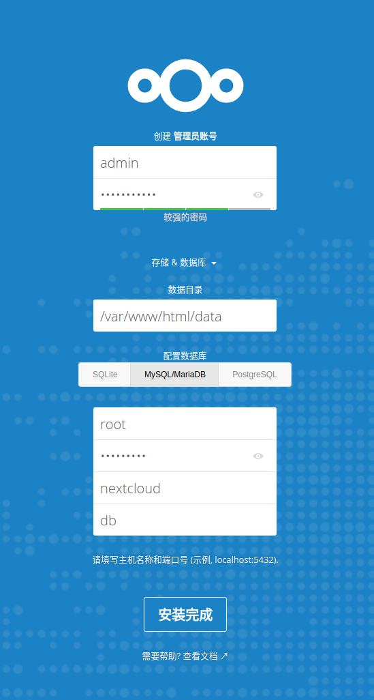

# Nextcloud搭建自己的云盘

## Nextcloud 简介 

近年来，国内众多免费网盘相继倒下，于是大家都转投了百度网盘门下，然而这只独角兽限速倒逼开通会员下载速度依旧很难改善，还能维持多久也一直都是一个未知数。也有部分人开始涌向国外的有免费额度的网盘，比如以前以数据安全保障出名的 Mega （由于核心人员出走最近好像也不行了）、微软的 OneDrive、老牌网盘 Dropbox、Box、谷家的 Google drive（除了微软的网盘其他几个网速都不怎么好）。在这么多产品中，一个计算机技术人员却难以选择一款合适的网盘，于是用 VPS 和对象存储搭建自托管的方案开始成为一种可行的方案。 Nextcloud 就是这样一款网盘，来源于 Owncloud 却较之更加强大、安全（集成 Office 文档、图片相册、日历、RSS阅读，几乎等同于一个私有的 Dropbox），搭建也是非常简单，适合大部分技术栈的技术人员。当然，此处先谈如何搭建 Nextcloud ，至于结合对象存储下回再说。

## Docker 搭建 Nextcloud 

Docker 部署软件的好处我就不多提了：简单、高效，极其适合运维人员的应用管理工具。下面就先谈使用 Docker 一键搭建 Nextcloud 。

## 安装 Docker 环境 \(centos7\)

```text
yum install docker
```

## 安装 docker-compose 工具 

* docker-compose 是一个由 Docker 官方提供的应用多容器搭配管理工具，适合一个应用需要多个容器配合统一管理，进一步简化部署、升级步骤。

```text
sudo curl -L "https://github.com/docker/compose/releases/download/1.22.0/docker-compose-$(uname -s)-$(uname -m)" -o /usr/local/bin/docker-compose
sudo chmod +x /usr/local/bin/docker-compose
$ docker-compose --version
docker-compose version 1.22.0, build 1719ceb
```

##  编写 docker-compose.yml 

* docker-compose 的管理主要依赖于一个名为 docker-compose.yml 的 yaml 文件来进行管理，当然这个文件也可以以任何别的名称并以 -f 文件名 的方式来启用，但必须是符合 yaml 格式和 Docker 官方定义的字段和方式。以下为本实验所需的内容，其中用到了 mariadb官方提供的数据库容器 和 Nextcloud 官方提供的应用容器。

```text
version: '2'

services:
  db:
    image: mariadb
    restart: always
    volumes:
      - /home/data/nextcloud/db:/var/lib/mysql
    environment:
      - MYSQL_ROOT_PASSWORD=root
      - MYSQL_PASSWORD=nextcloud
      - MYSQL_DATABASE=nextcloud
      - MYSQL_USER=nextcloud

  app:  
    image: nextcloud
    restart: always
    ports:
      - 7009:80
    links:
      - db
    volumes:
      - /home/data/nextcloud/www:/var/www/html
```

## 启动容器

```text
# 启动容器
sudo docker-compose up -d

# 更新nextcloud
sudo docker pull nextcloud
sudo docker-compose down && sudo docker-compose up -d
```

 然后 Nextcloud 就在 7009 端口（可自行修改 docker-compose.yml 文件来改变）开启好了，使用浏览器访问 [http://IP:7009](http://IP:7009) 。

## 应用初始化配置 

自行设置管理员用户名和密码，数据目录默认即可，数据库信息填写如 docker-composer.yml 中所示，数据库主机名填 db （配置文件中的数据库应用名）。



所有初始化配置填写完毕之后，等待大约半分钟左右安装完成就可以看见nextcloud的主目录页面。到此处， Docker 搭建 Nextcloud 应用就大功告成了（也可在80端口安装Nginx服务代理到7009端口，此处不加赘述）。

