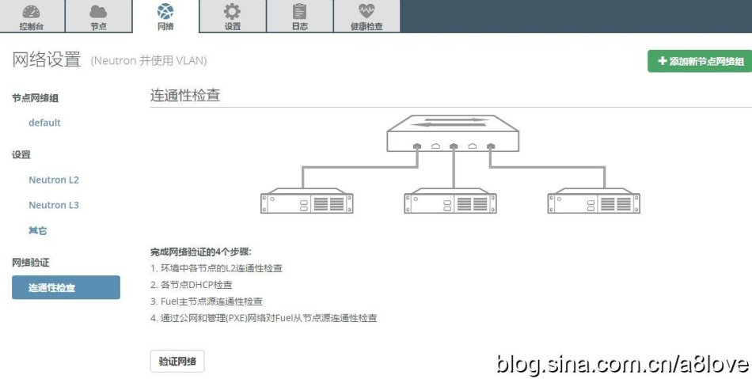

# 使用Fuel快速搭建OpenStack

## 下载Fuel镜像

* [https://wiki.openstack.org/wiki/Fuel\#Releases](https://wiki.openstack.org/wiki/Fuel#Releases)

## 下载本地Bootstraps Image

*  MOS9.0   本地源下载：链接：https://pan.baidu.com/s/1gNnHymigLPbyY4q2Y8uRdQ 密码：wbm4
*  MOS9.0 bootstrap下载：链接：https://pan.baidu.com/s/1sDzSOPYGzyhkMyx6G1LJUA 密码：5eoi

## 网络拓扑


## 工具准备

* VirtualBox
* 官方推荐使用CPU：4核，以及内存：4G以上、10G网卡、500G物理磁盘

## V添加3块虚拟网卡

```text
VirtualBox--全局设置--网络--仅主机（Host-Only）网络（H）-->

Host-Only Ethernet Adapter
IPv4: 10.20.0.10
Mask:255.255.255.0
DHCP: Unable
 
Host-Only Ethernet Adapter#2
IPv4: 172.16.0.1
Mask:255.255.255.0
DHCP: Unable
 
Host-Only Ethernet Adapter#3
IPv4: 192.168.0.1
Mask:255.255.255.0
DHCP: Unable
```

## 创建3台虚拟机

```text
Fuel-master       2C+ 60GB + 3网卡 +2GB 以上内存
Fuel-Controller   1C+120GB + 3网卡 +4GB
Fuel-Compute      1C+120GB + 3网卡 +4GB
```

* 创建Fuel-master


* 创建Fuel-Controller
* 创建Fuel-Compute

```text
Fuel-master       2C+ 60GB + 3网卡 +2GB 以上内存
Fuel-Controller   1C+120GB + 3网卡 +4GB
Fuel-Compute      1C+120GB + 3网卡 +4GB
```

## 加载Fuel镜像并启动Fuel-master


## 上传本地下载好的Bootstrap镜像

* 上传

```text
使用XFTP软件将本地源文件mirrors和bootstraps传到Fuel-master的/var/www/nailgun, 
具体如下图.也可以自己在PC或者服务器上建立FTP服务器，然后利用wget命令传输文件.
总之不管用什么方法都可以，只要能把文件上传到相应的文件夹内即可.(先把文件备份好)
```


* 激活镜像： 

```text
（1）fuel-bootstrap list
（2）fuel-bootstrap activated [uuid]
```


## 启动Fuel-controller和Fuel-compute

* 设置启动顺序为：【网络】启动第一
* 选择：【ubuntu\_bootstrap】启动

## 在Fuel的Web界面配置部署Openstack


* 添加节点：Compute和Controller
* 配置网络，验证网络
* 开始部署




## 登录OpenStack


  


