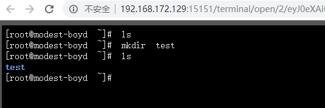

# 使用LDX创建管理基于容器的虚拟机

## 机器环境

*  Ubuntu 18.04 LTS

## 安装LDX

*  分别安装LXD， ZFS和bridge-utils
  * LXD 实现虚拟容器
  * ZFS 用于管理物理磁盘，支持LXD高级功能
  * bridge-utils 用于搭建网桥

```text
sudo apt-get install lxd zfsutils-linux bridge-utils
```

## 配置网桥

*  /etc/netplan/01-network-manager-all.yaml（文件名根据自己的来）

```text
# Let NetworkManager manage all devices on this system
network:
  version: 2
#  renderer: NetworkManager
  ethernets:
    ens33:
      dhcp4: true
  bridges:
    ldxbr0:
      interfaces: [ens33]
      dhcp4: true
```

*  sudo netplan apply  \(使配置生效\)

## 初始化LDX

*  sudo lxd init

```text
ubuntu@ubuntu-lxd-tut:~$ sudo lxd init
Name of the storage backend to use (dir or zfs): zfs
Create a new ZFS pool (yes/no)? yes
Name of the new ZFS pool: lxd
Would you like to use an existing block device (yes/no)? yes
Path to the existing block device: /dev/sdb1
Would you like LXD to be available over the network (yes/no)? no
Do you want to configure the LXD bridge (yes/no)? no
Warning: Stopping lxd.service, but it can still be activated by:
  lxd.socket
LXD has been successfully configured.
```

*  lxc network attach-profile ldxbr0 default eth0 （ 意思是默认ldxbr0作为新建容器的eth0网卡）

## 配置LXC镜像源（加速创建）

```text
lxc remote add tuna-images https://mirrors.tuna.tsinghua.edu.cn/lxc-images/ --protocol=simplestreams --public
lxc image list tuna-images:
```

##  启动容器虚拟机

```text
lxc launch tuna-images:centos/7/amd64 centos-vm1
# 这里启动了一台名字叫centos-vm1的容器虚拟机
```

## 进入容器虚拟机

```text
lxc exec centos-vm1 bash
```

## 安装LDX的WebUI

*  git clone https://github.com/AdaptiveScale/lxdui.git
*  cd lxdui
*  python3 setup.py install
*  lxdui start
* [http://server\_ip:15151](http://127.0.0.1:15151)
* 账号/密码： **admin** \| **admin**




