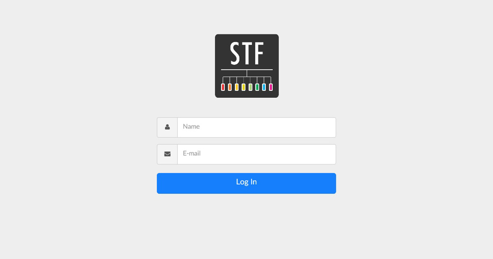
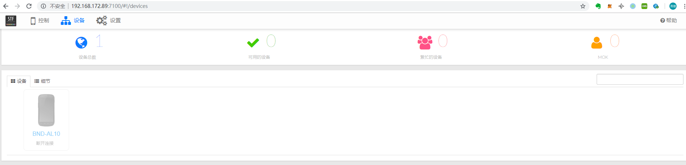

# 使用OpenSTF同时操作多台手机

## 机器环境

* CentOS7

## 部署OpenSTF

```text
# 创建rethinkdb用户
useradd rethinkdb

# 安装编译库
yum install wget git gcc gcc-c++

# 安装Node8.9.1
git clone https://github.com/creationix/nvm.git ~/.nvm
source ~/.nvm/nvm.sh
nvm install 8.9.1

# 安装rethinkdb
wget http://download.rethinkdb.com/centos/7/`uname -m`/rethinkdb.repo -O /etc/yum.repos.d/rethinkdb.repo
yum install rethinkdb -y
rethinkdb -v

# 安装其它依赖库
yum install android-tools -y
yum install GraphicsMagick -y
yum install zeromq -y
yum install zeromq-devel -y
yum install protobuf -y
yum install yasm -y

# 安装stf
npm install -g cnpm --registry=https://registry.npm.taobao.org
cnpm install -g stf
```

## 启动OpenSTF

```text
nohup rethinkdb &
nohup stf local --public-ip server_ip
访问：http://server_ip:7100
```





