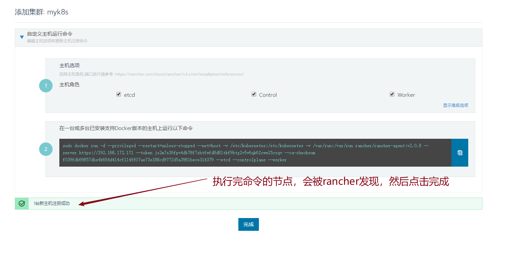
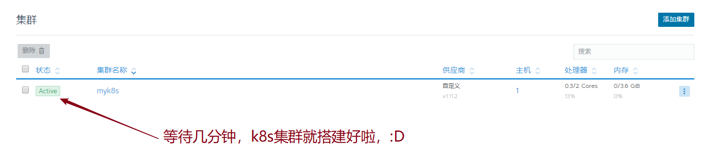

# 使用Rancher光速搭建K8s集群

## 机器环境

* CentOS7
* Docker最新版

## 安装Rancher

```text
sudo docker run -d --restart=unless-stopped -p 80:80 -p 443:443 rancher/rancher
```

* 访问 `https://server_ip`

## 在Web界面上操作






