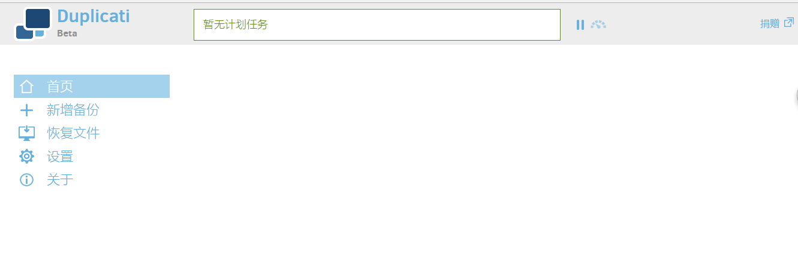

# 用Duplicati实现计划备份

## 简介

```text
Duplicati是一款开源的备份软件，可以实现计划增量备份和恢复
支持Windows，Linux，Mac平台
备份数据自动加密
可以把备份到远程服务器或者云计算平台上：
如Amazon S3、Google Drive、SkyDrive、Rackspace Cloud Files
可以按指定时间恢复文件
```

## 下载并安装Duplicati

* [https://www.duplicati.com/download](https://www.duplicati.com/download)

## 界面



