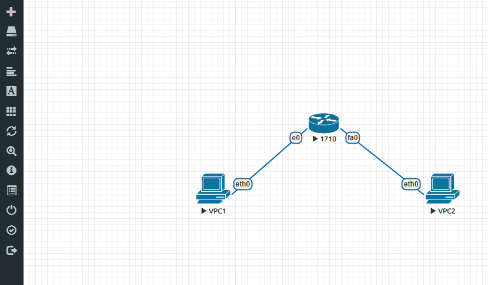

# 用EVE-NG做仿真网络实验

## 简介

> EVE-NG是类似华为 eNSP的网络仿真模拟器，可以用来做一系列的网络实验，免费！

## 下载EVE-NG镜像

* [http://eve-ng.cn/doku.php?id=eve-ng%E6%B1%89%E5%8C%96%E7%89%88](http://eve-ng.cn/doku.php?id=eve-ng%E6%B1%89%E5%8C%96%E7%89%88)

## 将镜像导入VMware并启动

* 账号/密码：root / eve

## 访问web操作界面

* http://server\_ip

