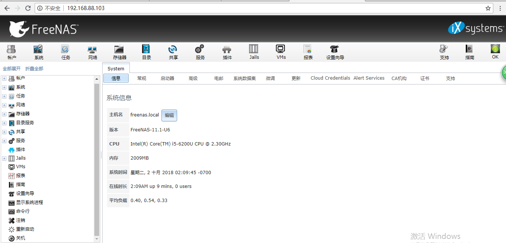

# 用FreeNAS搭建网络存储服务器

## 简介

* FreeNAS是一套免费的NAS服务器，它能将一部普通PC变成网络存储服务器。
* 有Web可视化操作界面
* 能提供的服务
* * FTP
  * iSCSI
  * NFS
  * Rsync
  * SMB
  * SSH
  * TFTP
  * 动态DNS

## 下载并安装FreeNAS11的镜像

* [http://www.freenas.org/download-freenas-release/](http://www.freenas.org/download-freenas-release/)
* 安装（内存推荐8G）

## 访问Web界面

