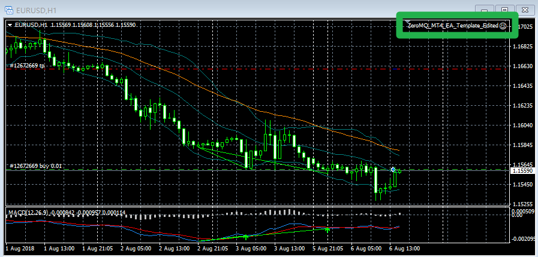

# 用Python写MT4自动交易策略来炒外汇

## 原理

* 使用MQL4原生语言调用ZERO-MQ作为消息接口服务端
* 使用Python作为ZERO-MQ的客户端，调用接口写MT4的自动交易策略

## 机器环境

* Win10
* Python3.6

## MQL4调用ZERO-MQ作为接口服务器代码

```c
#property version   "1.00"
#property strict

// 调用ZERO-MQ库: MQL-ZMQ from https://github.com/dingmaotu/mql-zmq
#include <Zmq/Zmq.mqh>
// 设置ZERO-MQ参数
extern string PROJECT_NAME = "DWX_ZeroMQ_Example";
extern string ZEROMQ_PROTOCOL = "tcp";
extern string HOSTNAME = "*";
extern int REP_PORT = 5555;
extern int PUSH_PORT = 5556;
extern int MILLISECOND_TIMER = 1;  // 1 millisecond
// 设置交易输入的参数
extern string t0 = "--- Trading Parameters ---";
extern int MagicNumber = 123456;
extern int MaximumOrders = 1;
// 交易时的手数，这里是0.01手，即1000美金
extern double MaximumLotSize = 0.01;

// CREATE ZeroMQ Context
Context context(PROJECT_NAME);

// CREATE ZMQ_REP SOCKET
Socket repSocket(context,ZMQ_REP);

// CREATE ZMQ_PUSH SOCKET
Socket pushSocket(context,ZMQ_PUSH);

// VARIABLES FOR LATER
uchar data[];
ZmqMsg request;

//+------------------------------------------------------------------+
//| Expert initialization function                                   |
//+------------------------------------------------------------------+
int OnInit()
  {
//---

   EventSetMillisecondTimer(MILLISECOND_TIMER);     // Set Millisecond Timer to get client socket input
   
   Print("[REP] Binding MT4 Server to Socket on Port " + REP_PORT + "..");   
   Print("[PUSH] Binding MT4 Server to Socket on Port " + PUSH_PORT + "..");
   
   repSocket.bind(StringFormat("%s://%s:%d", ZEROMQ_PROTOCOL, HOSTNAME, REP_PORT));
   pushSocket.bind(StringFormat("%s://%s:%d", ZEROMQ_PROTOCOL, HOSTNAME, PUSH_PORT));
   
   /*
       Maximum amount of time in milliseconds that the thread will try to send messages 
       after its socket has been closed (the default value of -1 means to linger forever):
   */
   
   repSocket.setLinger(1000);  // 1000 milliseconds
   
   /* 
      If we initiate socket.send() without having a corresponding socket draining the queue, 
      we'll eat up memory as the socket just keeps enqueueing messages.
      
      So how many messages do we want ZeroMQ to buffer in RAM before blocking the socket?
   */
   
   repSocket.setSendHighWaterMark(5);     // 5 messages only.
   
//---
   return(INIT_SUCCEEDED);
  }
//+------------------------------------------------------------------+
//| Expert deinitialization function                                 |
//+------------------------------------------------------------------+
void OnDeinit(const int reason)
{
//---
   Print("[REP] Unbinding MT4 Server from Socket on Port " + REP_PORT + "..");
   repSocket.unbind(StringFormat("%s://%s:%d", ZEROMQ_PROTOCOL, HOSTNAME, REP_PORT));
   
   Print("[PUSH] Unbinding MT4 Server from Socket on Port " + PUSH_PORT + "..");
   pushSocket.unbind(StringFormat("%s://%s:%d", ZEROMQ_PROTOCOL, HOSTNAME, PUSH_PORT));
   
}
//+------------------------------------------------------------------+
//| Expert timer function                                            |
//+------------------------------------------------------------------+
void OnTimer()
{
//---

   /*
      For this example, we need:
      1) socket.recv(request,true)
      2) MessageHandler() to process the request
      3) socket.send(reply)
   */
   
   // Get client's response, but don't wait.
   repSocket.recv(request,true);
   
   // MessageHandler() should go here.   
   ZmqMsg reply = MessageHandler(request);
   
   // socket.send(reply) should go here.
   repSocket.send(reply);
}
//+------------------------------------------------------------------+

ZmqMsg MessageHandler(ZmqMsg &request) {
   
   // Output object
   ZmqMsg reply;
   
   // Message components for later.
   string components[];
   
   if(request.size() > 0) {
   
      // Get data from request   
      ArrayResize(data, request.size());
      request.getData(data);
      string dataStr = CharArrayToString(data);
      
      // Process data
      ParseZmqMessage(dataStr, components);
      
      // Interpret data
      InterpretZmqMessage(&pushSocket, components);
      
      // Construct response
      ZmqMsg ret(StringFormat("[SERVER] Processing: %s", dataStr));
      reply = ret;
      
   }
   else {
      // NO DATA RECEIVED
   }
   
   return(reply);
}

// Interpret Zmq Message and perform actions
void InterpretZmqMessage(Socket &pSocket, string& compArray[]) {

   Print("ZMQ: Interpreting Message..");
   
   // Message Structures:
   
   // 1) Trading
   // TRADE|ACTION|TYPE|SYMBOL|PRICE|SL|TP|COMMENT|TICKET
   // e.g. TRADE|OPEN|1|EURUSD|0|50|50|R-to-MetaTrader4|12345678
   
   // The 12345678 at the end is the ticket ID, for MODIFY and CLOSE.
   
   // 2) Data Requests
   
   // 2.1) RATES|SYMBOL   -> Returns Current Bid/Ask
   
   // 2.2) DATA|SYMBOL|TIMEFRAME|START_DATETIME|END_DATETIME
   
   // NOTE: datetime has format: D'2015.01.01 00:00'
   
   /*
      compArray[0] = TRADE or RATES
      If RATES -> compArray[1] = Symbol
      
      If TRADE ->
         compArray[0] = TRADE
         compArray[1] = ACTION (e.g. OPEN, MODIFY, CLOSE)
         compArray[2] = TYPE (e.g. OP_BUY, OP_SELL, etc - only used when ACTION=OPEN)
         
         // ORDER TYPES: 
         // https://docs.mql4.com/constants/tradingconstants/orderproperties
         
         // OP_BUY = 0
         // OP_SELL = 1
         // OP_BUYLIMIT = 2
         // OP_SELLLIMIT = 3
         // OP_BUYSTOP = 4
         // OP_SELLSTOP = 5
         
         compArray[3] = Symbol (e.g. EURUSD, etc.)
         compArray[4] = Open/Close Price (ignored if ACTION = MODIFY)
         compArray[5] = SL
         compArray[6] = TP
         compArray[7] = Trade Comment
   */
   
   int switch_action = 0;
   
   if(compArray[0] == "TRADE" && compArray[1] == "OPEN")
      switch_action = 1;
   if(compArray[0] == "RATES")
      switch_action = 2;
   if(compArray[0] == "TRADE" && compArray[1] == "CLOSE")
      switch_action = 3;
   if(compArray[0] == "DATA")
      switch_action = 4;
   
   string ret = "";
   int ticket = -1;
   bool ans = FALSE;
   double price_array[];
   ArraySetAsSeries(price_array, true);
   
   int price_count = 0;
   
   switch(switch_action) 
   {
      case 1: 
         InformPullClient(pSocket, "OPEN TRADE Instruction Received");
         // IMPLEMENT OPEN TRADE LOGIC HERE
         break;
      case 2: 
         ret = "N/A"; 
         if(ArraySize(compArray) > 1) 
            ret = GetBidAsk(compArray[1]); 
            
         InformPullClient(pSocket, ret); 
         break;
      case 3:
         InformPullClient(pSocket, "CLOSE TRADE Instruction Received");
         
         // IMPLEMENT CLOSE TRADE LOGIC HERE
         
         ret = StringFormat("Trade Closed (Ticket: %d)", ticket);
         InformPullClient(pSocket, ret);
         
         break;
      
      case 4:
         InformPullClient(pSocket, "HISTORICAL DATA Instruction Received");
         
         // Format: DATA|SYMBOL|TIMEFRAME|START_DATETIME|END_DATETIME
         price_count = CopyClose(compArray[1], StrToInteger(compArray[2]), 
                        StrToTime(compArray[3]), StrToTime(compArray[4]), 
                        price_array);
         
         if (price_count > 0) {
            
            ret = "";
            
            // Construct string of price|price|price|.. etc and send to PULL client.
            for(int i = 0; i < price_count; i++ ) {
               
               if(i == 0)
                  ret = compArray[1] + "|" + DoubleToStr(price_array[i], 5);
               else if(i > 0) {
                  ret = ret + "|" + DoubleToStr(price_array[i], 5);
               }   
            }
            
            Print("Sending: " + ret);
            
            // Send data to PULL client.
            InformPullClient(pSocket, StringFormat("%s", ret));
            // ret = "";
         }
            
         break;
         
      default: 
         break;
   }
}

// Parse Zmq Message
void ParseZmqMessage(string& message, string& retArray[]) {
   
   Print("Parsing: " + message);
   
   string sep = "|";
   ushort u_sep = StringGetCharacter(sep,0);
   
   int splits = StringSplit(message, u_sep, retArray);
   
   for(int i = 0; i < splits; i++) {
      Print(i + ") " + retArray[i]);
   }
}

//+------------------------------------------------------------------+
// Generate string for Bid/Ask by symbol
string GetBidAsk(string symbol) {
   
   double bid = MarketInfo(symbol, MODE_BID);
   double ask = MarketInfo(symbol, MODE_ASK);
   
   return(StringFormat("%f|%f", bid, ask));
}

// Inform Client
void InformPullClient(Socket& pushSocket, string message) {

   ZmqMsg pushReply(StringFormat("%s", message));
   // pushSocket.send(pushReply,true,false);
   
   pushSocket.send(pushReply,true); // NON-BLOCKING
   // pushSocket.send(pushReply,false); // BLOCKING
   
}
```

## Python客户端代码

```python
# -*- coding: utf-8 -*-
# 引入ZERO-MQ库
import zmq
import numpy as np


class zmq_python():
    
    def __init__(self):
        # Create ZMQ Context
        self.context = zmq.Context()

        # Create REQ Socket
        self.reqSocket = self.context.socket(zmq.REQ)
        self.reqSocket.connect("tcp://localhost:5555")

        # Create PULL Socket
        self.pullSocket = self.context.socket(zmq.PULL)
        self.pullSocket.connect("tcp://localhost:5556")
    
    def remote_send(self, socket, data):
    
        try:
            socket.send_string(data)
            msg_send = socket.recv_string()
            print (msg_send)

        except zmq.Again as e:
            print ("Waiting for PUSH from MetaTrader 4..")
            
    def remote_pull(self, socket):
    
        try:
            msg_pull = socket.recv(flags=zmq.NOBLOCK)
            return msg_pull

        except zmq.Again as e:
            print ("Waiting for PUSH from MetaTrader 4..")
            
    
    def get_data(self, symbol, timeframe, start_bar, end_bar):
        '''
        only start_bar and end_bar as int
        '''
        self.data = "DATA|"+ symbol+"|"+"PERIOD_"+timeframe+"|"+str(start_bar)+"|"+str(end_bar+1)
        self.remote_send(self.reqSocket, self.data)
        prices= self.remote_pull(self.pullSocket)
        prices_str= str(prices)
        price_lst= prices_str.split(sep='|')[1:-1]
        price_lst= [float(i) for i in price_lst]
        price_lst= price_lst[::-1]
        price_arr= np.array(price_lst)
        return price_arr
    
    def buy_order(self, symbol, stop_loss, take_profit):
        self.buy= "TRADE|OPEN|0|"+ str(symbol)+"|"+str(stop_loss)+"|"+str(take_profit)
        self.remote_send(self.reqSocket, self.buy)
        reply= self.remote_pull(self.pullSocket)
        return reply
    
    def sell_order(self, symbol, stop_loss, take_profit):
        self.buy= "TRADE|OPEN|1|"+ str(symbol)+"|"+str(stop_loss)+"|"+str(take_profit)
        self.remote_send(self.reqSocket, self.buy)
        reply= self.remote_pull(self.pullSocket)
        return reply
    
    def close_buy_order(self):
        self.close_buy= "TRADE|CLOSE|0"
        self.remote_send(self.reqSocket, self.close_buy)
        reply= self.remote_pull(self.pullSocket)
        return reply
    
    def close_sell_order(self):
        self.close_sell= "TRADE|CLOSE|1"
        self.remote_send(self.reqSocket, self.close_sell)
        reply= self.remote_pull(self.pullSocket)
        return reply
```

## 简单的移动均线交易策略（SMA）

```python
import pythonicMT4 
import talib
from time import sleep

symbol= 'EURUSD'
timeframe= 'H1'
start= 0
end= 2000
period= 96
stopLoss= 500
takeProfit= 1000
order= ''

trade= pythonicMT4.zmq_python()

while True:
    try:
        prices= trade.get_data(symbol= symbol, timeframe= 'H1', start_bar=start, end_bar=end)
        SMA= talib.SMA(prices, timeperiod=period)
        # prices[-1]表示当前价格
        # SMA[-1]表示当前均线价格
        print ("Current price: {} \nSMA: {}".format(prices[-1], SMA[-1]))
        
        if order != 'Buy' and order != 'Sell':
            if (prices[-1] > prices [-2]) and (prices[-1]<SMA[-1]):
                order= 'Buy'
                trade.buy_order(symbol= symbol, stop_loss= stopLoss, take_profit= takeProfit)
                
            else:
                if (prices[-1] < prices[-2]) and (prices[-1] > SMA[-1]):
                    order= 'Sell'
                    trade.sell_order(symbol= symbol, stop_loss= stopLoss, take_profit= takeProfit)
                
        if order== 'Buy' and prices[-1]>SMA[-1]:
            order= ''
            trade.close_buy_order()
        
        else:
            if order== 'Sell' and prices[-1]<SMA[-1]:
                order= ''
                trade.close_sell_order()
    except:
        continue
    
    sleep(100)
```

## Github地址

* [https://github.com/ns2250225/py-mt4](https://github.com/ns2250225/py-mt4)

## 效果展示




