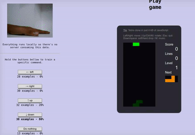

# 用Tensorflow.js和摄像头玩俄罗斯方块

## 原理

* 利用webRTC技术录制手势图像，手势图像分别为向下，向左，向右和变形
* 利用Tensorflow.js进行图像分类的训练，用来识别录制好的手势图像

## Github地址

* [https://github.com/mari-linhares/teachable-machine-games](https://github.com/mari-linhares/teachable-machine-games)

## 效果展示

